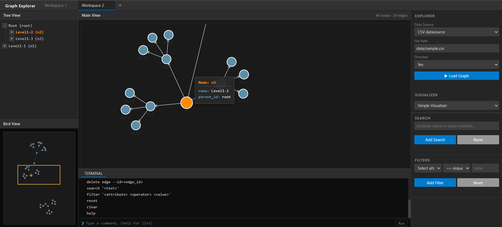
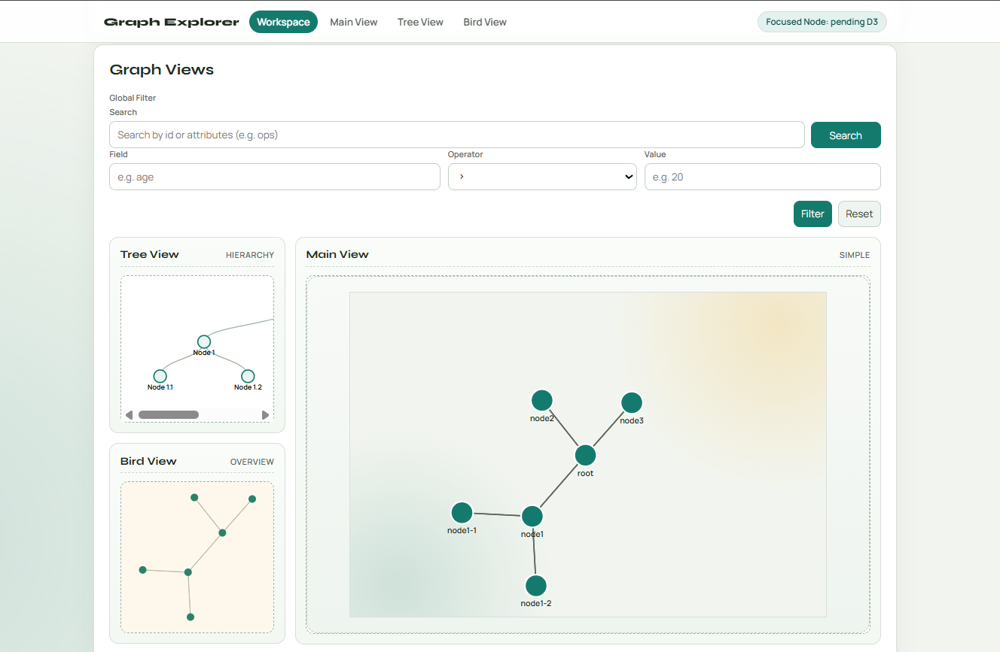

# Graph Explorer

Graph Explorer is a **plugin-based web application** for visualizing and exploring graph structures from different data sources.  
The system allows loading graphs, visualizing them in multiple ways, and interacting with them through a web interface.


## Features

- Plugin-based architecture
- Support for **directed, undirected, cyclic, and acyclic graphs**
- Multiple visualization modes
- Graph **search and filtering**
- **CLI commands** for graph manipulation
- Multiple **workspaces**
- Web applications in **Django** and **Flask**

## Screenshots

### Flask Explorer


### Django Explorer



## Project Structure

```
api/                    # Shared interfaces and graph model
platform/               # Core logic and plugin communication
json-plugin/            # JSON data source plugin
csv-plugin/             # CSV data source plugin
xml-plugin/             # XML data source plugin
simple-visualizer/      # Simple graph visualization
block-visualizer/       # Block-style graph visualization
graph-explorer-django/  # Web applications (Django)
graph-explorer-flask/   # Web applications (Flask)
assets/                 # Screenshots
```


## Installation

### Windows (recommended)

Run:

```
install.bat
```

This script will:

- create a virtual environment
- install all plugins
- install dependencies


### Manual installation

Create and activate virtual environment:

```
python -m venv .venv
.venv\Scripts\activate
```

Upgrade pip:

```
pip install --upgrade pip
```

Install components:

```
pip install -e ./api
pip install -e ./platform
pip install -e ./json-plugin
pip install -e ./csv-plugin
pip install -e ./xml-plugin
pip install -e ./simple-visualizer
pip install -e ./block-visualizer
pip install django
pip install flask
```


## Running the Application

### Django

```
python manage.py runserver
```

### Flask

```
flask run
```

## Contributors

- SV5/2023 – Marko Pavlovic  
- SV46/2023 – Vukasin Vitomirovic  
- SV47/2023 – Ognjen Miletic  
- SV49/2023 – Ognjen Vujovic  
- SV80/2023 – Aleksandar Papic  


# License

This project was developed as part of a university course project.
